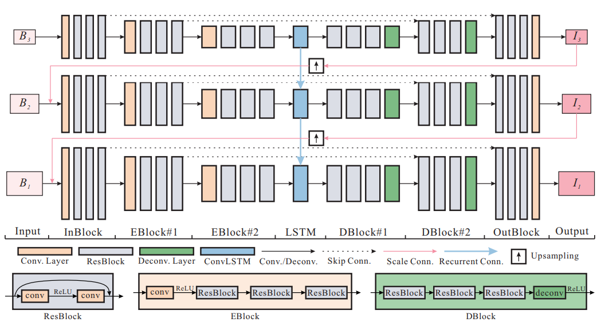

## Scale-recurrent Network for Deep Image Deblurring 
### 介绍
SRN for deblurring是CVPR2018的一篇图像去模糊的论文，对比了CVPR2018的其他关于图像去模糊的论文，这一篇是效果最好，只是时间消耗会更多，但单张图片所用的时间也只是1.8s。
文章实现了一个新的网络结构，结合了前人采用的U-net（encoder-decoder网络）和多尺度网络，达到了state-of-the-art。
网络结构如下：


### 运行

运行文件是`run_model.py`

```bash
python run_model.py --input_path=./testing_set --output_path=./testing_res
```
如果有GPU，可以添加`--gpu`参数，并添加gpu的编号。如：
```bash
python run_model.py --gpu=0
```
如果没有GPU，使用CPU，可以:
```bash
python run_model.py --gpu=-1
```
### 结果
原始的模糊图片：

去模糊后的图片

